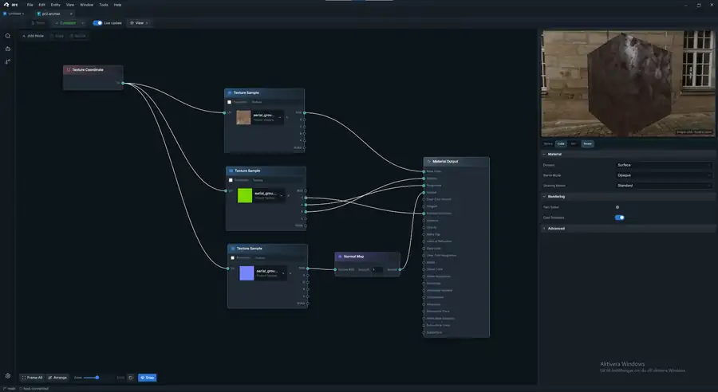

# arc

| Target | Status |
| --- | --- |
| Clang | [](https://github.com/richardthorell/arc/actions/workflows/build-clang.yml) |
| GCC | [](https://github.com/richardthorell/arc/actions/workflows/build-gcc.yml) |
| MSVC | [](https://github.com/richardthorell/arc/actions/workflows/build-msvc.yml) |

**arc** is a modern C++20 3D game engine with an integrated editor, built around explicit systems, data-oriented runtime architecture, and source-controlled projects.

ARC is pre-1.0 and under active development. The engine, renderer, asset pipeline, project tooling, and editor are developed together so the same runtime systems used by games are also used for authoring, previewing, and debugging content.


## Current state

ARC is already a working engine/editor stack rather than an editor mock-up around a renderer. The current codebase includes:

- **Runtime foundation** — application lifecycle, fixed-step simulation, jobs, memory tracking, diagnostics, asynchronous IO, input, math, SIMD, and platform services.
- **ECS and scenes** — stable entities, paged component storage, prepared queries, structural command buffers, reflection, hierarchy, transforms, prefabs/templates, cameras, lights, bounds, persistence, and render extraction.
- **Rendering** — backend-neutral render interfaces with a Vulkan backend, render graph resources, renderer-owned handles, materials, scene draw packets, CPU culling/sorting/batching, environment lighting, shadows, picking, and editor viewport rendering.
- **Assets and projects** — GUID-backed assets, a rebuildable SQLite asset registry, import/dependency scheduling, derived data, asynchronous loading, hot reload, project descriptors, templates, and the native `arc-project` CLI.
- **Authoring tools** — scene editing, hierarchy and inspectors, content browsing, asset previews, material graphs, texture editing, Flow graphs, terrain tools, render-graph inspection, model/skeleton tools, and project creation/opening.
- **Runtime content systems** — scene persistence, terrain, water, project modules, cooking/packaging infrastructure, and installed-SDK support.

The repository is organized as small engine modules with explicit dependencies under `engine/`. Consumers can use individual modules or the aggregate `arc` target.

## Editor

The ARC editor uses **Electron + React** for the workbench and a **native C++ host** for authoritative engine state and rendering.

The split is intentional:

- Electron owns docking, documents, menus, hierarchy, inspectors, content tools, graph editors, and other authoring UX.
- The native host owns scene state, transforms, history, persistence, project operations, viewport input, asset/runtime integration, and rendering.
- The viewport is rendered by the engine and embedded into the editor rather than reimplemented in the web UI.
- Editor-to-host contracts keep UI code separated from runtime and renderer internals.

The editor currently includes the scene viewport, hierarchy, component inspector, content browser, project browser, asset previews, material editor, texture editor, Flow graph editor, terrain tooling, render graph inspection, model/skeleton tooling, and shared property/control infrastructure.



The material editor uses the same asset and renderer path as the rest of the editor. Material graphs compile into the engine material representation and can be previewed directly against the native renderer.

## Building

From the repository root, configure, build, and test the default native targets with:

```bash
cmake --preset default
cmake --build --preset default --parallel
ctest --preset default
```

CMake presets keep generated files under `out/build/...`. ARC has Debug, RelWithDebInfo, and Shipping product configurations, plus dedicated Vulkan, coverage, and Clang sanitizer presets.

For example:

```bash
cmake --preset sanitize-address-undefined
cmake --build --preset sanitize-address-undefined --parallel
ctest --preset sanitize-address-undefined

cmake --preset sanitize-thread
cmake --build --preset sanitize-thread --parallel
ctest --preset sanitize-thread
```

### Running the editor

For normal editor development, use the repository runner:

```bash
python run_editor.py
```

`run_editor.py` owns the development setup so a fresh checkout does not require manually reproducing the editor build sequence. A normal run does the following:

1. Checks the required development tools unless `--no-install` is supplied.
2. Resolves the pinned Slang shader compiler, using an existing configured/system/cached copy or provisioning the pinned toolchain when needed.
3. Configures the native editor build incrementally under `out/build/editor-vulkan`.
4. Builds `arc_host_process` and `arc-project-cli`. CMake/MSBuild/Ninja perform an incremental no-op when those targets are already current.
5. Checks the Electron dependency tree and runs `npm ci` only when `node_modules` is missing or stale, unless dependency setup is explicitly skipped.
6. Exposes the native host, project tool, and project templates to the Electron process.
7. Launches the editor through the configured npm script (`dev` by default).

On Windows, the prerequisite check covers CMake, Node.js/npm, and Visual Studio 2026 or 2022 with **Desktop development with C++**, the MSVC x64/x86 tools, and a Windows SDK. The runner can install or upgrade supported CMake and Node.js components through Windows Package Manager after asking for confirmation. Visual Studio is never installed automatically. When a tool installation changes the host environment, the runner exits and asks you to open a new terminal before running it again.

Useful runner modes:

| Option | Purpose |
| --- | --- |
| `--check-prerequisites` | Report editor development prerequisites and exit. |
| `--install-prerequisites` | Prompt to install supported missing prerequisites, then exit. |
| `--no-install` | Skip prerequisite detection and installation prompts. |
| `--quick-start` | Open the persistent Blank 3D development project under `out/` and bypass the project browser. |
| `--force-build` | Discard the native CMake build tree and recreate the native/npm preparation state. |
| `--build-only` | Build/prepare the editor, run the TypeScript typecheck, and exit without launching. |
| `--no-vulkan-render` | Build the native host without the Vulkan viewport backend. |
| `--skip-npm-install` | Do not repair/install Electron dependencies. |
| `--clear-asset-db [PROJECT]` | Delete the rebuildable `.arc/cache/assets.db*` registry before launch. |
| `--ui-lab` | Launch the standalone editor UI control lab without building or starting the native engine host. |
| `--perf` | Enable editor startup and slow-operation timing diagnostics. |
| `--perf-slow-ms MS` | Set the slow-operation threshold and enable performance diagnostics. |

A few common examples:

```bash
# Check a machine before the first editor build
python run_editor.py --check-prerequisites

# Jump directly into the persistent development project
python run_editor.py --quick-start

# Recreate the native build tree when the cached generator/toolchain is stale
python run_editor.py --force-build

# Validate the editor without opening Electron
python run_editor.py --build-only

# Work on shared editor controls without starting the engine host
python run_editor.py --ui-lab
```

Electron dependencies are lockfile-driven. If working directly inside `editor/`, use `npm ci` rather than `npm install`:

```bash
cd editor
npm ci
npm run typecheck
npm run lint
npm run format:check
npm test
```

## Projects and SDK

ARC projects are standalone directories described by a version-2 `<Project>.arcproject` file. The native `arc-project` tool is shared by the command line and editor project workflow.

Installed project templates currently include **Blank 3D**, **Blank Headless**, **Rendering Sample**, and **Empty C++**. A project keeps source-controlled content in `Source/`, `Content/`, `Config/`, and `Plugins/`; generated editor state, caches, intermediate files, and build products live outside those source directories.

An installed ARC SDK can create, validate, configure, and build projects without referencing the engine checkout:

```bash
arc-project create --name MyGame --destination MyGame \
  --template blank-3d --templates <ARC>/share/arc/templates --engine 0.1.0

arc-project validate --project MyGame/MyGame.arcproject --require-paths
arc-project configure --project MyGame/MyGame.arcproject --sdk <ARC>
arc-project build --project MyGame/MyGame.arcproject --config RelWithDebInfo
```

External CMake projects can consume the relocatable SDK through the exported package:

```cmake
find_package(ARC 0.1.0 EXACT CONFIG REQUIRED COMPONENTS Runtime Vulkan)
target_link_libraries(MyGame PRIVATE ARC::Runtime ARC::RenderVulkan)
```

Engine installations are registered through an `arc-installation.json` manifest:

```bash
arc-project engine register --manifest <ARC>/arc-installation.json
arc-project engine list
arc-project engine verify
arc-project toolchains
```

## CI

ARC continuously validates the engine and editor across the primary compiler families:

- **Clang 18 / Ubuntu 24.04** — native build and tests, Vulkan validation, installed-SDK checks, plus ASan/UBSan and TSan coverage in dedicated jobs.
- **GCC 14 / Ubuntu 24.04** — native build and tests with Vulkan compile coverage.
- **MSVC / Windows Server 2022** — native engine/editor build and tests, packaging and product validation where applicable.
- **Quality and coverage** — formatting, static analysis, dependency policy, shader validation, and LLVM source coverage.

Pull requests classify their changes so expensive validation can be scoped appropriately, while merges to `main` retain the broader repository checks.
